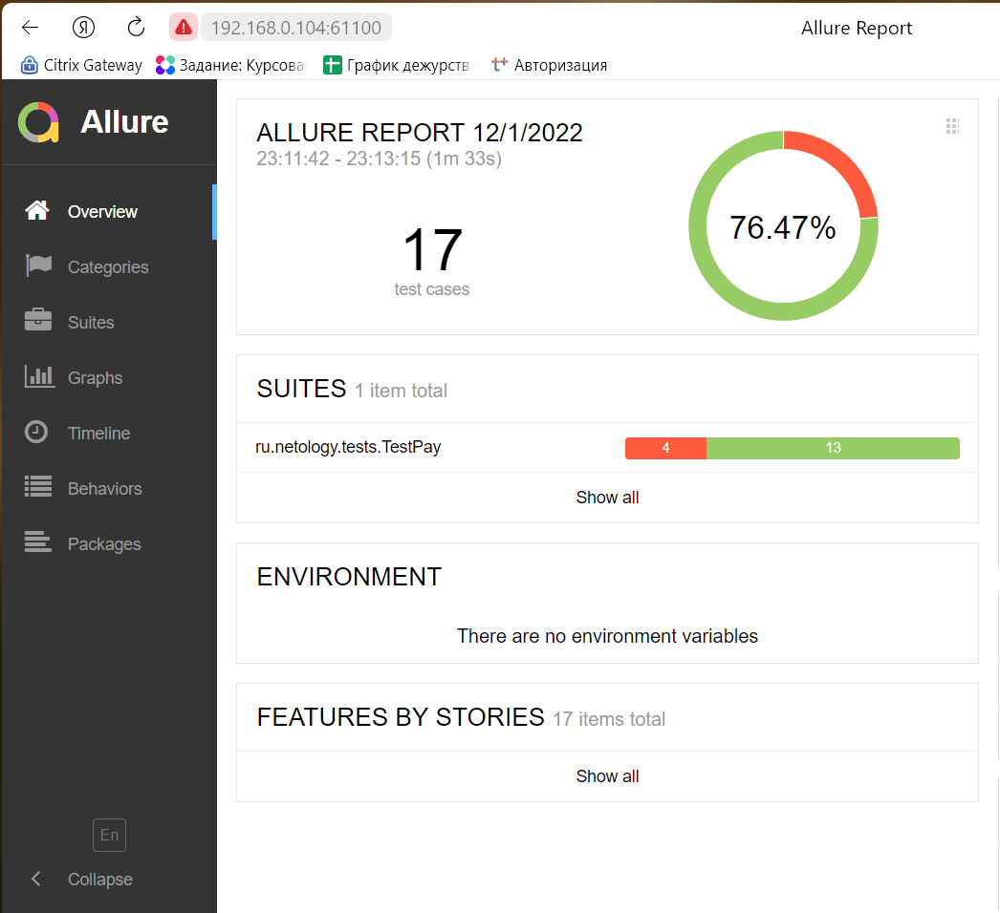

## Отчет по итогам автоматизированного тестирования

# Краткое описание
- В ходе автоматизации тестирования были реализованы позитивные и негативные сценарии заполнения тестовой страницы.
- Реализована поддержка двух БД - MySQL и PostgreSQL.
- Для написания и развертывания тестовых сценариев были использованы:

1. Intellij IDEA
2. Java 11
3. Docker для развертывания тестовой среды и упаковки готового тествого продукта
4. Junit 5
5. Selenide
6. Lombok для упрощения работы с классами и Faker для генерации данных
7. Allure для подготовки отчетности
8. MySql и PostgreSQL как заявленные поддерживаемые БД

Приложение было протестировано по всем запланированным позитивным и негативным сценариям.

## Количество тест-кейсов
Общее количество тест-кейсов = 17

Из них:

позитивных тест-кейсов = 13
негативных тест-кейсов = 4
76,47% тест-кейсов прошли успешно, 23,53% тестов прошли неуспешно.

По итогам тестирования обнаружено 7 багов.

По всем багам заведены [Issues](https://github.com/TATYANA-QA42/Diplom-QA/issues)

Выявлены следующие ошибки:

- не установлены ограничения на символы, вводимые в поля, и их количество;
- выводятся некорректные уведомления пользователю после заполнения формы и ее отправки в банк;

- В первую очередь необходимо:

- добавить ограничения на количество символов, т.к. их отсутствие влияет на безопасность системы;
- настроить вывод корректных сообщений пользователю, т.к. в первую очередь система предназначена для взаимодействия с клиентами.

